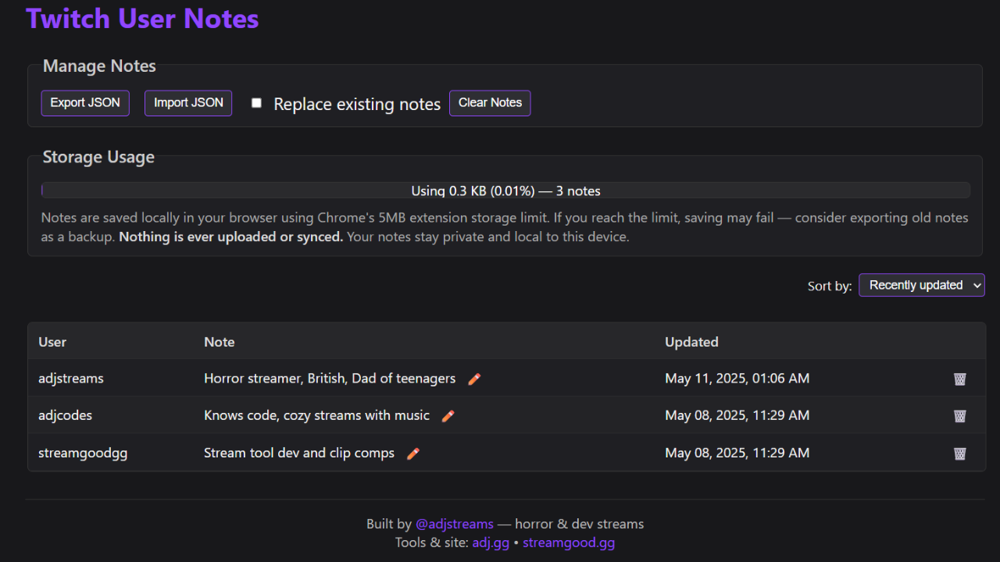
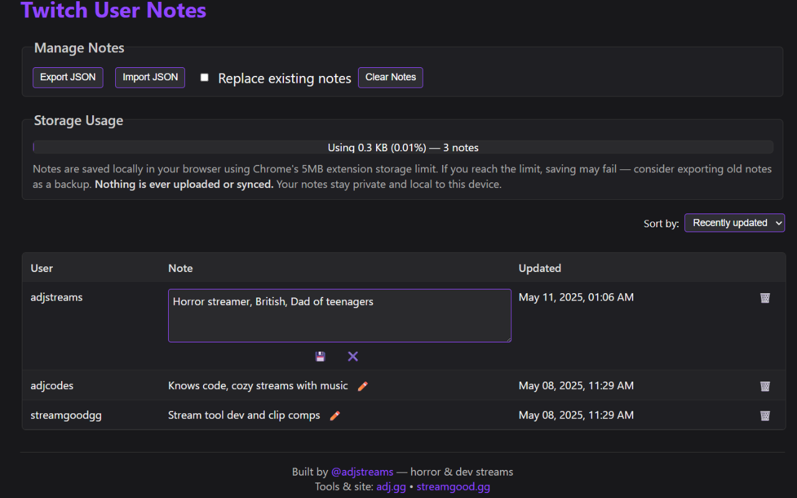
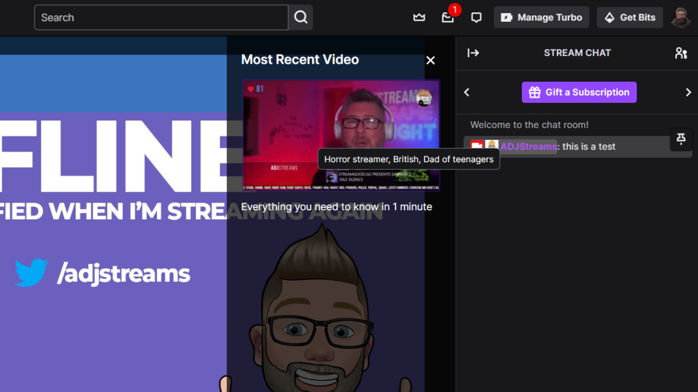
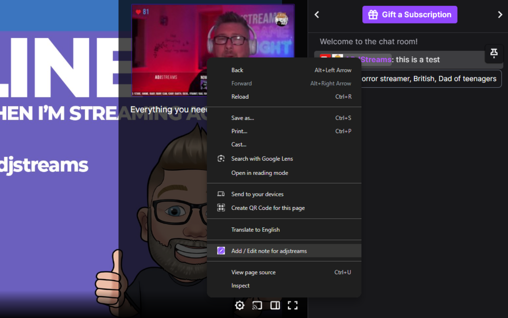
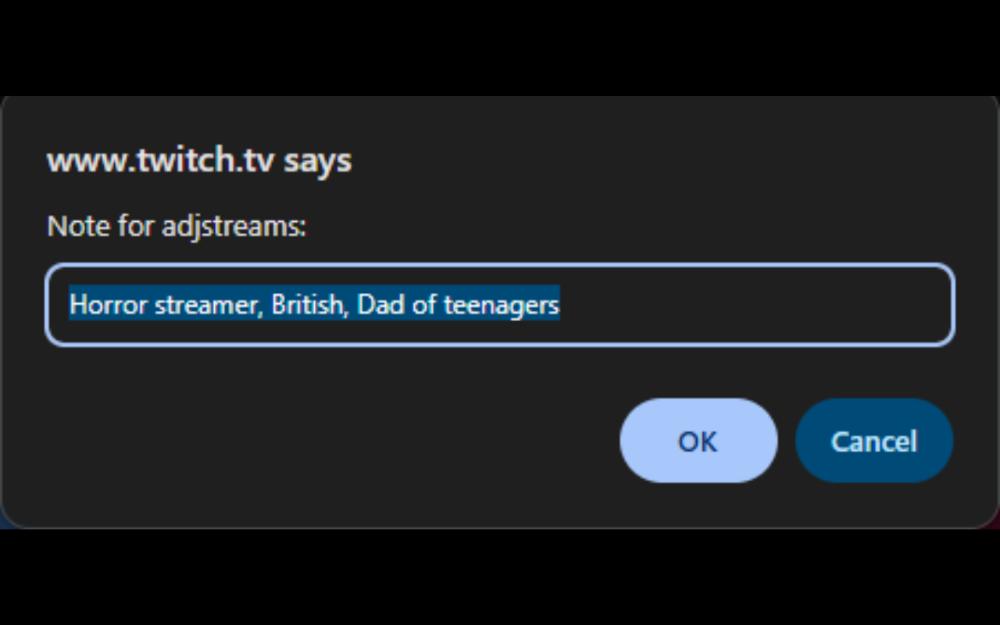

# 📝 Twitch User Notes

[](https://github.com/adjstreams/twitch-user-notes/actions/workflows/unit-test.yml)
[](https://codecov.io/gh/adjstreams/twitch-user-notes/tree/main)
[](./LICENSE)
[](https://chrome.google.com/webstore/detail/kilabhmmhdoaeaipfjlnenphmgpfcijk)

A lightweight Chrome extension to add personal notes to Twitch usernames. Hover over users in chat or on browse pages and instantly remember why you followed them — or why you didn’t.

---

## ✨ Features

- 📝 Add, edit, and delete personal notes for any Twitch user  
- 💬 Tooltips on hover across chat, sidebars, and cards  
- ☁️ Syncs with your browser storage (and shows usage)  
- 🔁 Import/export your notes for backup or sharing  

---

## 🧙‍♂️ Why?

Because your follows list is full of forgotten raids and mystery streamers. This extension gives your memory a second brain.

---

## 🚀 Install

You can now install the extension directly from the Chrome Web Store:  
👉 [**Twitch User Notes on Chrome Web Store**](https://chrome.google.com/webstore/detail/twitch-user-notes/kilabhmmhdoaeaipfjlnenphmgpfcijk)


To install manually (e.g. for testing specific versions):

1. Download the latest release zip  
2. Go to `chrome://extensions` and enable **Developer mode**  
3. Click **Load unpacked**, then select the unzipped folder

---

## 🛠️ For Developers

This project uses TypeScript, Vitest, Playwright, and follows a modular, testable architecture.

### Quick Start

Clone the repo, then:

```bash
npm install     # Install dependencies
npm run dev     # Dev build with hot reload
```

For full dev setup, including test and lint scripts, see [📘 Developer Docs](./docs/index.md).

---

## 📚 Documentation

- [🔧 Architecture](./docs/architecture.md)
- [🧪 Testing](./docs/testing.md)
- [🕵️ Privacy Policy](./docs/privacy.md)
- [🤝 Contributing](./CONTRIBUTING.md)

---

## 🛡️ License

MIT — see [LICENSE](./LICENSE) for details.

---

## 📸 Preview

### Options UI

### Editing notes on Options screen


### Hover over users for messages


### Add note to chat user


### Edit note on Twitch


---

---

## ❓ FAQ

### Where are notes stored?

Notes are saved in your browser using `chrome.storage.local`. They never leave your device unless you export them.

---

### Do notes sync between devices?

Nope. If you use multiple browsers or PCs, you’ll need to export and import manually from the Options screen.

---

### I installed the extension, but don’t see anything?

Make sure you’re on the Twitch website and refresh the tab. Then right click on usernames in chat or sidebars to add/edit a note. Your existing notes will show as tooltips.

---

### Can I back up my notes?

Yes! Go to the Options page and use **Export Notes** to save a `.json` backup.

---

### Firefox version?

Not yet. Want it? [Open an issue](https://github.com/adjstreams/twitch-user-notes/issues).

---

## 🙋‍♀️ Questions / Feedback

Open an issue or start a discussion in the repo.

## 👋 About the Author

Built with ❤️ by [ADJ](https://adj.gg), also known as  
🎮 [adjstreams](https://twitch.tv/adjstreams) — horror/variety streamer with chaotic energy  
🧘 [adjcodes](https://twitch.tv/adjcodes) — chill late-night dev streams  

This is one of many small tools created by the same dev behind [streamgood.gg](https://streamgood.gg) — Twitch tools for streamers who want a little more magic.

Got feedback, ideas, or need help? [Open an issue](https://github.com/adjstreams/twitch-user-notes/issues).
